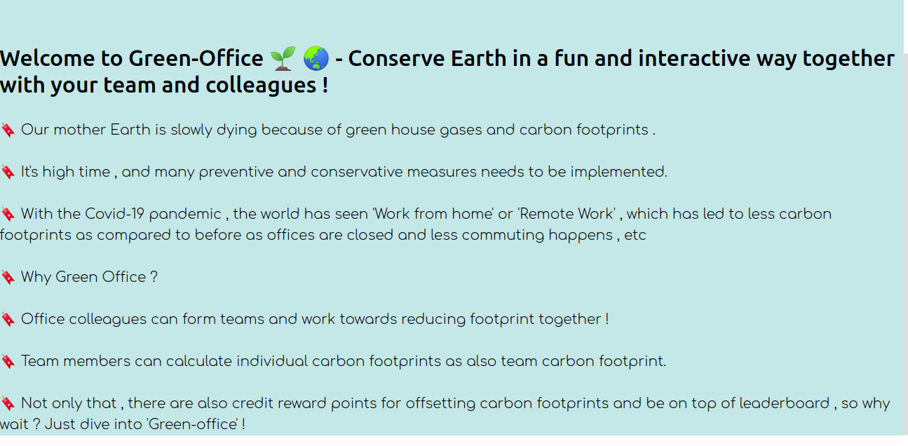
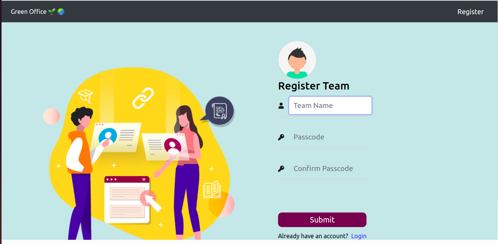
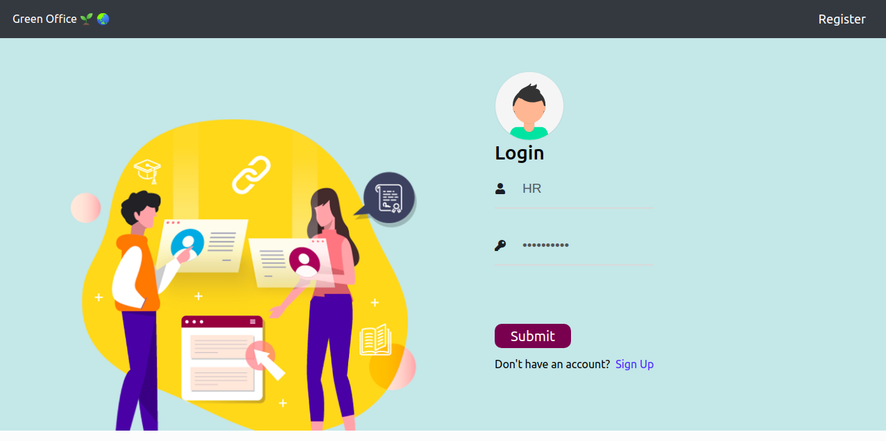
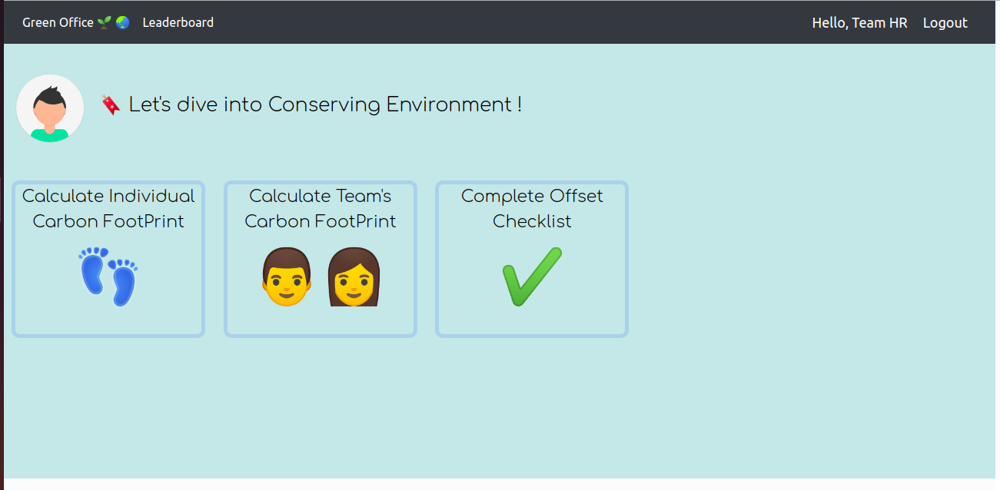
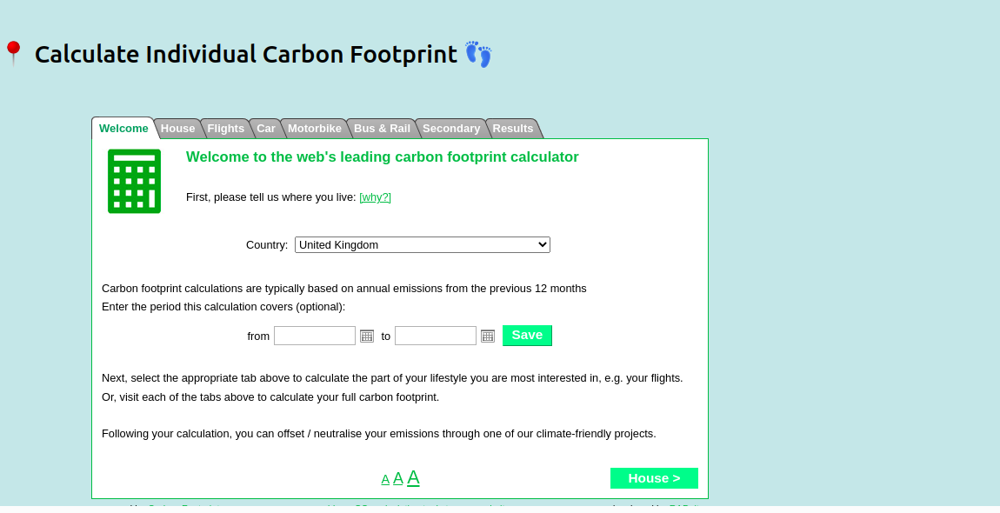
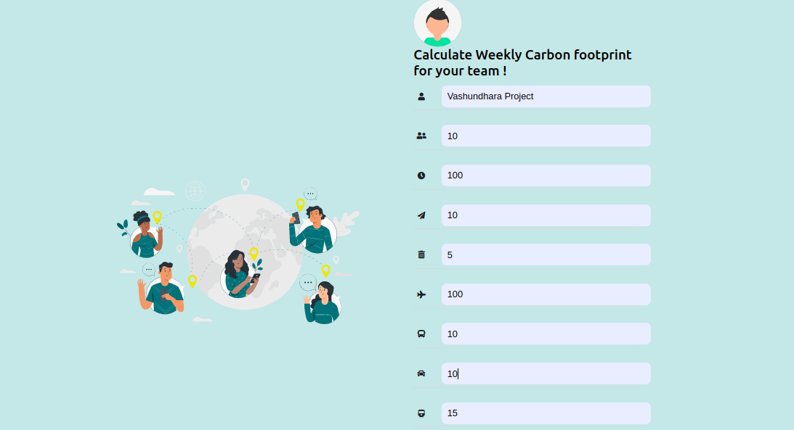
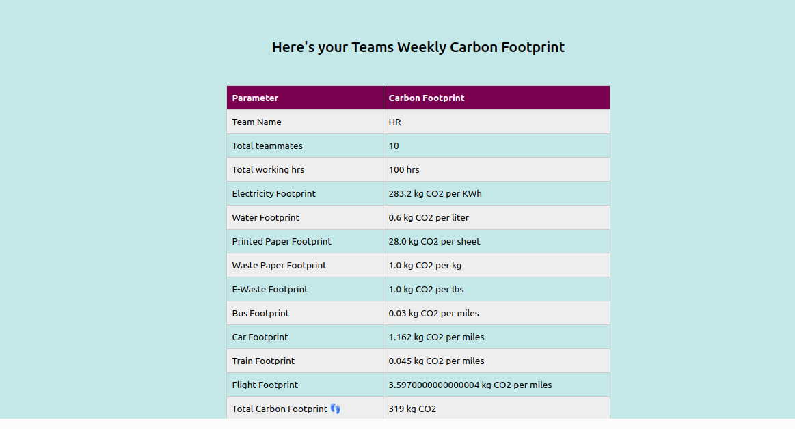
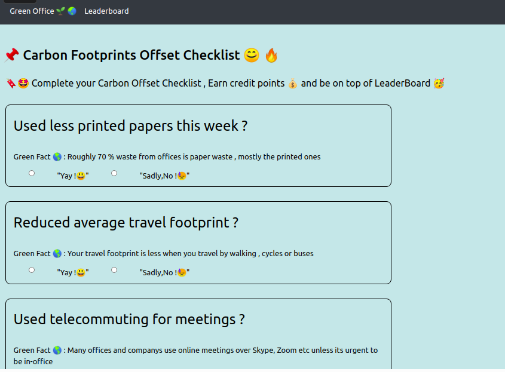
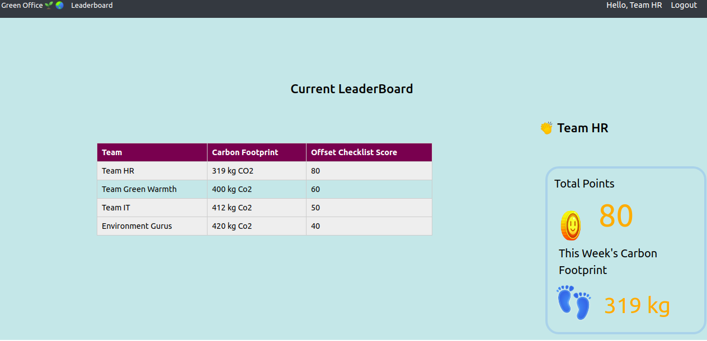

<h1 align="center">Green-Office 🌱 🌏 </h1>

🌟 Hola , Office Colleagues out there ! Conserve Earth in a fun and interactive way together with your team and colleagues !  🤩

## * Need and Motivation:

🔖 Our mother Earth is slowly dying because of green house gases and carbon footprints .

🔖 It's high time , and many preventive and conservative measures needs to be implemented.

🔖 With the Covid-19 pandemic , the world has seen 'Work from home' or 'Remote Work' ,
  which has led to less carbon footprints as compared to before as offices are closed and less commuting happens , etc

## * Why Green Office :

* [x] Team members can calculate individual carbon footprints as also team carbon footprint ! 👣

* [x] Office colleagues can form teams and work towards reducing footprint together ! 👦👧

* [x] Not only that , there are also credit reward points for offsetting carbon footprints and be on top of leaderboard 🔥

## * Tech Stack:

* HTML , CSS , JavaScript.

* Django Framework

## * Individual footprint calculator:

* This was embedded from <a href ="https://www.carbonfootprint.com/integrate.html"> Source </a>

## Install the requirements with :

      pip install -r requirements.txt
 
 
- Run the django app with  :

      python3 manage.py runserver
      

## Future Scope

* [ ] Enabling selections / options for team to select parameters and then calculate it. 

* [ ]  Integrating Paytm payment details , or payment apps to track travel time , electricity usage , meals usage , etc and then analyze carbon footprint usage.

## * Video : <a href="https://www.youtube.com/watch?v=YQTi4ZVM4xE"> Here </a>

## Demo :

